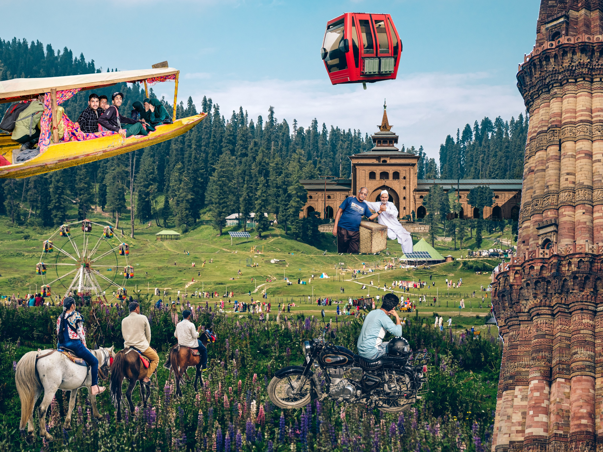
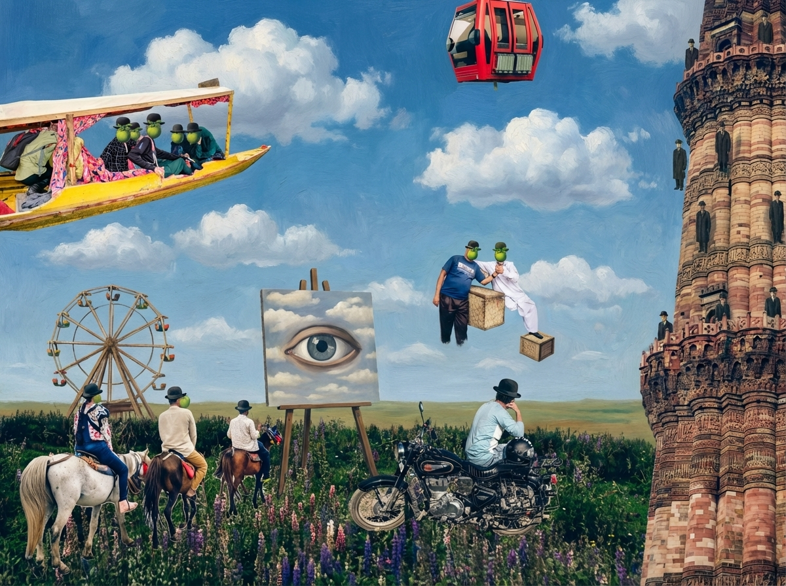
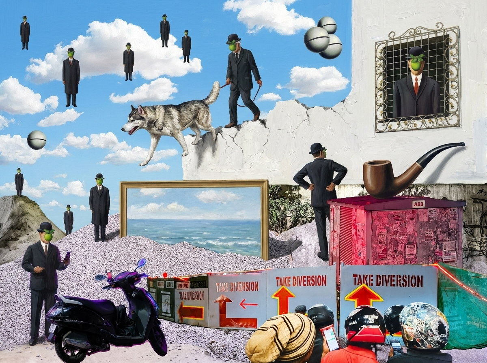
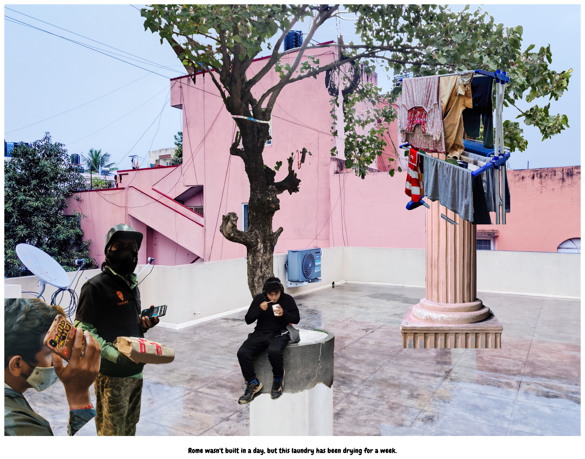

# ngl – Not Gonna Lie!

A creative photo-based storytelling tool that gives you the freedom to reassemble your visual memories into compelling, surrealistic narratives. 

⚠️ **Fair warning**: This app can be quite addictive once you start building your stories! Use responsibly :)

## 🍏 What is ngl?

> *"A fictional world more representative of reality than dull reality itself."*

Think of ngl as a creative partner for visual storytelling. Upload your photos, and the app uses AI to identify the most significant elements within them. 

Then, like assembling a collage, you can layer these elements to create new compositions that capture the emotional truth of your experiences—even if they never existed quite this way in reality. 

This approach mirrors how human memory actually works: fragmented, layered, and emotionally weighted rather than photographically accurate.

### The Philosophy

This tool emerged from photographer Mahesh Shantaram's MFA Photography research examining:

- How **computational imaging** on mobile phones creates fundamentally new photographic possibilities

- The role of **AI in artistic production** rather than mere reproduction

- **Algorithmic aesthetics** and surrendering creative control to reveal new perspectives

- **Digital colonialism and gig economy** critique through the lens of technology and labour

AI and computational photography can reveal deeper truths about our experiences. **ngl** builds on the concept of &ldquo;softimages&rdquo;—images that exist as software programs, infinitely adaptable and merged with computational processes, representing a fundamentally different kind of photograph for our digital age.

The project originally explored the gig economy—Mahesh Shantaram slogged as a nightly delivery boy on the streets of Bangalore, on an electric bicycle and documented this already-surreal world using night photography and computational imaging. This evolved into a broader investigation of how AI can help &ldquo;reassemble a fictional world more representative of reality than dull reality itself.&rdquo;

[📖 Read the original project vision (2023)](https://sway.cloud.microsoft/m4okFOpHUOMNhkgh) 

[📖 Read a short essay on AI-mediated photography](https://sway.cloud.microsoft/vvSDtHl3igv36KMY)

## 🍏 Getting Started

### What You'll Need

- **Node.js** installed on your computer ([Download here](https://nodejs.org/))
- A **Gemini API key** from Google ([Get one free](https://ai.google.dev/))

### Installation

1. **Clone or download this repository**
   ```bash
   git clone https://github.com/thecont1/ngl-storyteller.git
   cd ngl-storyteller
   ```

2. **Install dependencies**
   ```bash
   npm install
   ```

3. **Set up your API key**
   - Create a file called `.env.local` in the project folder
   - Add this line: `GEMINI_API_KEY=your_api_key_here`
   - Replace `your_api_key_here` with your actual Gemini API key

4. **Run the app**
   ```bash
   npm run dev
   ```

5. **Open your browser** to the URL shown in your terminal (usually `http://localhost:3000`)

## 🍏 How to Use

1. **Set the scene** – Select a photograph that lays out the scene where your story will unfold. 

2. **Build your story** – Upload new images, one by one. The app uses AI to identify the most significant object(s) in them. 

3. **Compose your narrative** – Take charge of your story by editing the layers, moving around the objects, and even applying readymade styles.

4. **Generate a caption** – Add a border, if you wish, for that photo frame look. Then get AI to generate a witty caption for your surreal story.

5. **Save your Story** – Here, you have possibilities. I recommend you do all of them, usually in this order.

   ☘️ *Save Raw Data* (`.ngl`): The most efficient way to save your story. It contains all the data needed to pick up from where you left off and recreate your story.

   ☘️ *Save Project* (`.png`): A static image of your story loaded with all the layers and styles. Just drop this into the app and you're ready to resume your surrealisation.

   ☘️ *Download Image* (`.jpg`): A plain and static image of your story. Best for sharing on social media.

   ☘️ *Save as Magritte*: 
   
## 🍏 Save as Magritte

**Save as Magritte** is an AI-powered feature trained on René Magritte's iconic works, allowing you to infuse his distinctive surrealism into your own compositions. The transformation uses 11 carefully selected Magritte paintings as style references, capturing his oil painting texture, dreamlike compositions, and philosophical playfulness.

| Original Composition | Magritte Reimagining |
|:--------------------:|:--------------------:|
|  |  |
*Meadow in Kashmir, 2019/2025*

| Original Composition | Magritte Reimagining |
|:--------------------:|:--------------------:|
|  |  |
*Ghost Story, 2021/2025*

| Original Composition | Magritte Reimagining |
|:--------------------:|:--------------------:|
|  |  |
*Evening on the terrace, 2021/2025*

## 🍏 Cost Monitor

To encourage responsible use of AI resources, ngl includes a built-in cost monitor that tracks your API usage in real-time. This transparency helps you stay aware of the computational resources powering your creative experiments.

## 🍏 Use Cases

- **Personal storytelling** – Create visual narratives about travel, life events, or daily experiences

- **Artistic projects** – Explore new forms of digital photography and computational art

- **Memory reconstruction** – Build layered visual memories that feel more authentic than single photos

- **Documentary reimagined** – Tell stories about places, people, or experiences in unconventional ways

## 🍏 Technical Details

Built with:
- Google AI Studio w/ Gemini 3 Pro Preview
- Gemini 3 Pro Image Preview for all image analysis
- React + TypeScript
- Vite for development
- Modern web technologies for interactive presentations
- René Magritte collection on WikiArt Visual Art Encyclopedia

## 📄 License

This project is open source and available under the MIT License.

## 🍏 Acknowledgments

The original project idea was developed as part of Mahesh Shantaram's MFA Photography research at Ulster University in 2021-2023

[Google DeepMind Hackathon](https://www.kaggle.com/competitions/gemini-3/overview) - *Vibe Code with Gemini 3 Pro in AI Studio*

[WikiArt Visual Art Encyclopedia](https://www.wikiart.org/en)

***